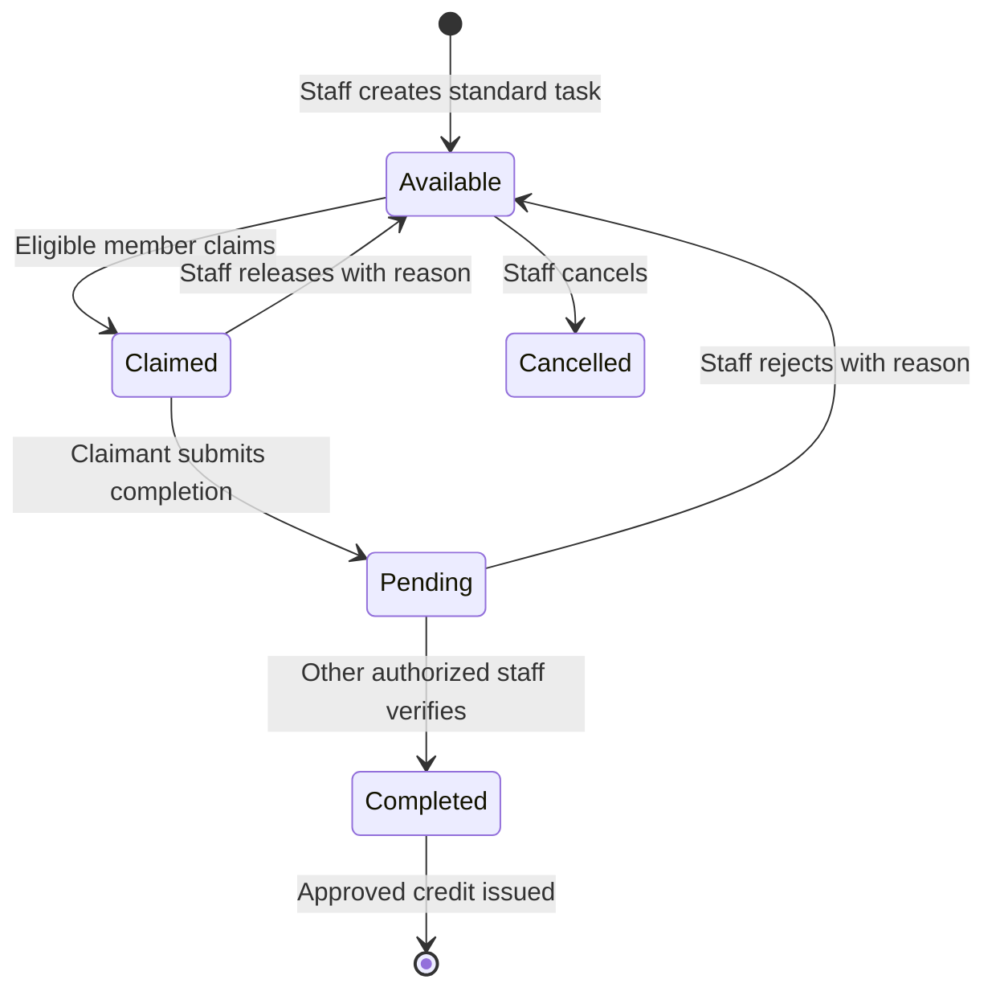
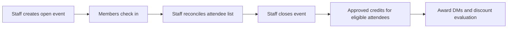

# Volunteer tasks, events, and credits

This guide explains how members volunteer, how staff verify their work, and how
volunteer credits become membership subscription discounts. Credits are volunteer
points; a credit is not a dollar or a payment-method balance.

Verified against source on **October 4, 2026**:

- React revision `403dd43896e58d59a685c21646f3702590c539f2`.
- Rails revision `e98a7d8b222f18af328703e3d0836297e34ef47f`.

Defaults below describe the code, not the settings of a particular deployment.
Rails links are pinned to the reviewed revision. React links point to source in
this repository. Material differences between portal and Slack behavior are
identified explicitly.

Claim messages also communicate the monthly processing policy described below.
That policy is followed by volunteer approvers; the application does not schedule
credits for a future month or change the ledger's date calculations.

## Contents

- [Quick answers and navigation](#quick-answers-and-navigation)
- [Permissions and eligibility](#permissions-and-eligibility)
- [Creating and publishing opportunities](#creating-and-publishing-opportunities)
- [Claiming and verifying tasks](#claiming-and-verifying-tasks)
- [Joining and closing events](#joining-and-closing-events)
- [Notification matrix](#notification-matrix)
- [Accumulating and correcting credits](#accumulating-and-correcting-credits)
- [Redeeming credits for membership discounts](#redeeming-credits-for-membership-discounts)
- [Lifetime totals and leaderboard](#lifetime-totals-and-leaderboard)
- [Technical appendix](#technical-appendix)

## Quick answers and navigation

| Question | Current behavior |
| --- | --- |
| Who creates a task or event? | Admins and board members globally; resource managers for their assigned shops. Ordinary members cannot create them. |
| Does creating an event announce it on Slack? | No ordinary event announcement is posted. The event is open immediately, and an existing shop volunteer canvas can be refreshed. |
| Does a task claim need approval? | No. An eligible claim is recorded immediately. Review starts after the claimant submits completion. |
| Who hears about submitted completion? | The configured pending-volunteer channel, default `general`. Individual reviewers do not receive DMs. |
| How does the claimant hear the decision? | Task verification sends an award DM; release or rejection sends a DM with the reason, if the member has a current linked Slack identity. |
| How does event attendance earn credit? | An authorized staff member closes the event, issuing approved credits to its eligible recorded attendees. There is no individual attendance-approval stage. |
| When should I expect activity credits? | Volunteer approvers apply credits in the month following the activity date: an April task completion is reflected in May credit totals. This is a monthly processing policy followed by approvers, not an automatic scheduling rule. |
| How are points cashed in? | Normal award/approval flows automatically evaluate configured subscription-discount thresholds. There is no member cash-in button. |
| Can points pay shop fees or rent? | No redemption path is implemented for shop fees, rentals, invoices, or cash payouts. The credit-redemption integration applies Braintree subscription discounts. |
| Does redemption reduce lifetime points? | No. It marks credits as used for discounts. Lifetime totals remain, subject to reversals or record deletion. |

Use these entry points:

| Location | What it provides |
| --- | --- |
| Staff **Volunteer** page, `/volunteer` | **Credits**, **Bounty Tasks**, and **Events** tabs. Admins, board members, and RMs can enter; individual actions still require Rails authorization. |
| Your own profile, `/members/:id/volunteer` | Summary, **Open Events**, **My Active Claims**, **Available Bounty Tasks**, and **Credit History**. The Volunteer tab is shown on your own profile, not someone else's profile. |
| **Home**, `/home` | Up to five randomly selected eligible tasks/events for members with status `activeMember`. **Claim Task** and **Join Event** act immediately. See [Member home](member-home.md). |
| **Workshops**, `/workshops` | Shop-specific tasks on the Volunteer tab and upcoming event information. Authorized users can use **Create Bounty Task** to open the staff task form with that shop preselected. |
| Bounty link, `/volunteer/tasks/:id` | Task/bounty details and available claim/completion actions; linked bounties include source-ticket access. |
| Slack, `/volunteer` | Help and subcommands for personal progress, task/event listings, claims, completion submissions, and authorized staff actions. [Command reference](#slack-command-reference) below. |
| Public displays | `/volunteer/bounties` and `/volunteer/leaderboard`; separate from the authenticated React staff page. |

Sources: [staff UI][react-admin], [member UI][react-member],
[profile tabs][react-profile], [routes][react-routing],
[workshops][react-workshops], and [bounty detail][react-bounty].

## Permissions and eligibility

### Staff permissions

An **assigned RM** is a resource manager recorded as a manager of the relevant
shop. An RM role by itself does not authorize managing every shop or a task/event
with no shop. Administrative listings can show records outside an RM's managed
shops; seeing a record does not authorize changing it.

| Action | Admin / board member | Resource manager | Ordinary member |
| --- | --- | --- | --- |
| Create or manage task/event | Any shop or no shop | Assigned shops only | No |
| Move opportunity to another shop or remove its shop | Allowed for ordinary opportunities | Destination must also be assigned; cannot remove shop | No |
| Verify task completion, release claim, reject completion | Globally; cannot review own claim | Assigned shop; cannot review own claim | No |
| Add/remove event attendees or close event | Globally | Assigned shop | Only own check-in/removal through self-service |
| Edit task credit value in portal | Yes; positive value, no update maximum | Field is not offered | No |
| Award standalone credit in portal | Another eligible member | Another eligible member; not shop-scoped | No |
| Approve/reject standalone credit | Cannot review a credit awarded to oneself | Same rule; not shop-scoped | No |
| Reverse or delete general credit | Yes; reversal requires a reason | No | No |
| Delete ordinary task/event | Yes | No | No |
| Publish repair-ticket bounty | Global authority; cannot be ticket reporter | Assigned ticket shop; cannot be reporter | No |

For ordinary tasks the API permits an authorized RM to edit credit values even
though the portal hides that field; linked bounty credit changes require admin or
board authority. The portal also limits delete buttons to terminal tasks and
closed events, while the ordinary delete API does not enforce those status
restrictions. Linked repair bounties cannot be deleted through that API.

Standalone credit review prevents the recipient reviewing their own credit. It
does not require a reviewer different from the person who submitted the manual
award. Repair-report rewards have a stricter independent-review rule described
under [credit sources](#credit-sources).

Sources: [shop authorization][rails-auth], [task administration][rails-admin-tasks],
[event administration][rails-admin-events], [credit administration][rails-admin-credits],
and [portal capabilities][react-permissions].

### Member eligibility

The model's `active_membership_status?` accepts both `activeMember` and `pending`.
That name does not mean all volunteer actions require the same membership status
or an unexpired paid term. **Privileged** below means admin, board member, or RM.
Required checkouts are non-revoked `ToolCheckout` records for every prerequisite.

| Path | Membership and expiration | Prerequisites and other restrictions |
| --- | --- | --- |
| Ordinary task claim, portal or Slack | Exactly `activeMember`; no membership-expiration check | Required checkouts for ordinary members; privileged roles bypass ordinary-task prerequisites. Task must be claimable. |
| Linked repair-bounty claim | Fully active and unexpired | Actual required checkouts for every role; ticket reporter cannot claim; linked ticket must still allow claiming. |
| Task detail page | Fully active and unexpired, or linked-ticket read authority for viewing | Its Claim capability requires an available task and fully active/unexpired member, even for ordinary tasks. Multi-use parents are claimed through the lists/Slack. |
| Submit task completion | Current claimant of a `claimed` task | No new membership/prerequisite test in the completion transition. |
| Verify task through portal API | Claimant must still exist and be `activeMember` or `pending` | Authorized staff different from claimant; task must be pending. |
| Verify task through Slack | Rejects an existing claimant outside those statuses | Same staff/shop/self-review rules; missing-claimant handling differs from portal API. |
| Event check-in or staff addition | `activeMember` or `pending`; no expiration check | Ordinary attendees need prerequisites; privileged attendees bypass them. Open event and no duplicate attendee. |
| Event credit at closure | Attendee still exists and is `activeMember` or `pending` | Closure does not recheck prerequisites or expiration. |
| Standalone manual award | Recipient `activeMember` or `pending` | Cannot award oneself; positive value and description required. |
| Home suggestions | Exactly `activeMember` | Applies opportunity eligibility, plus the recommendation exclusions below. |

Home excludes child tasks, cooling recurring tasks, previously used reusable
tasks, and repeatable/recurring tasks for which the member already has a claimed
or pending child. This is recommendation filtering: the underlying repeatable
claim operation allows simultaneous claims. Home recommends only events dated
**after today** that the member has not joined; same-day and undated events may
still be joined elsewhere.

The task API and Slack do not enforce a one-active-standard-task limit per
member. Each standard task can have one claimant, but a member may hold multiple
different tasks. The profile UI contains a one-task message/check that searches
the claimable feed; claimed tasks are absent from that feed, so this is not a
reliable server-enforced restriction.

Task projections redact hidden shop/tool identifiers and names for viewers
without catalog-management access. Redaction does not remove stored
prerequisites or make an ineligible claim valid.

Sources: [membership status][rails-member], [task model][rails-task],
[event model][rails-event], [member APIs][rails-member-api],
[Home eligibility][rails-home], [linked bounty rules][rails-bounty],
and [detail access][rails-detail] / [capabilities][rails-detail-serializer].

## Creating and publishing opportunities

### Ordinary tasks

On `/volunteer`, open **Bounty Tasks**, choose **Create Task**, enter the title,
description, credit value, task type, and optional shop/checkouts, then submit.
The record is immediately in its selected type/status; no draft or publish step
follows. A workshop's **Create Bounty Task** button opens this form with its shop
preselected.

| Setting | Behavior |
| --- | --- |
| Title and description | Required. |
| Credit value | Defaults to 1; positive finite fractions allowed. Creation maximum is `volunteer_task_max_credit`, then `VOLUNTEER_TASK_MAX_CREDIT`, then 2. The portal form advertises a maximum of 2. |
| Shop | Optional for admin/board; must be an assigned shop for an RM. |
| Prerequisite tools | Optional; require a shop, and every selected tool must belong to it. |
| Recurrence interval | Required positive whole number of days for recurring tasks. Portal starts with 7 days. |

| Type | What a claim does | Repeat rules |
| --- | --- | --- |
| Standard (`available`) | Changes that task to `claimed` | One claimant for this record; completion retires it. |
| Reusable (`reusable`) | Creates a numbered child claim; parent stays available as a template | Each member may have one claimed, pending, or completed child. A denied/cancelled attempt permits another claim. |
| Repeatable (`repeatable`) | Creates a numbered child claim; parent stays on the board | Repeated and simultaneous claims are permitted. |
| Recurring (`recurring`) | Creates a child and sets the parent's next-available date | Shared cooldown begins at claim, across all members, not at completion. |

Each child copies its parent's title, description, credit value, shop, and
prerequisites. Parent edits do not update existing children. Recurring parents
retain status `recurring` during cooldown but disappear from claimable listings.
**Reset Cooldown** clears the timing fields; releasing/rejecting a child does not.

In the portal, **Edit** is offered for available, claimed, and multi-use parent
statuses. Admin/board can change positive credit values without the creation
maximum, and API edits record credit-value changes in the audit log. The generic
ordinary-task API accepts broader lifecycle edits than the portal exposes.

Source: [task model][rails-task], [task administration][rails-admin-tasks],
and [task forms][react-admin].

### Ordinary events

On `/volunteer`, open **Events**, choose **Create Event**, fill in the form, and
submit. Title and positive credit value are required; description, date, shop,
and prerequisites are optional. Credits default to 1. Rails does not impose the
ordinary-task creation maximum on event credits. Shop and prerequisite ownership
rules match tasks.

The date is a calendar date, not a scheduled start/end time. A new event is
immediately `open`. The only normal states are `open` and `closed`; there is no
draft, publish, cancellation, or reopen action. Staff may edit metadata even
after closure, but doing so does not change credits already issued.

Source: [event model][rails-event], [event administration][rails-admin-events],
and [event forms][react-admin].

### Slack visibility and canvases

Creating, editing, or deleting an ordinary task/event does **not** post a new
Slack channel announcement, use a tool's `announce_channel`, or DM event
attendees about the change. Applicable controller actions enqueue a refresh of
an existing volunteer canvas for the associated shop, using `shop.slack_channel`.
Reassignment refreshes the old and new shops. A global opportunity has no shop
canvas destination. Portal availability does not wait for Slack delivery.

The canvas shows claimable parent tasks and open events dated today or later.
It omits undated events, child claims, and cooling recurring parents. A claim
refresh can show the just-claimed task struck through. An existing canvas can
be refreshed to show empty lists when opportunities disappear.

The ordinary sync job does not create a missing canvas. The operational
`reservations:rebuild_slack_canvases` task can create one when the shop has a
resolvable Slack channel and at least one qualifying opportunity. It grants
ownership to linked admins, board members, and assigned RMs. See the [jobs
inventory][rails-jobs-doc] for the rebuild procedure and its wider effects.

Slack `/volunteer close` does not enqueue the event canvas refresh that portal
closure enqueues. Rebuilding canvases refreshes stale content.

Sources: [volunteer canvas][rails-canvas], [canvas sync job][rails-canvas-job],
and [canvas rebuild integration][rails-reservation-canvas].

### Repair-ticket bounties

Reporting a repair ticket does not automatically create a volunteer task. An
authorized admin/board member or assigned-shop RM, different from the reporter,
can turn an active ticket into a bounty. This creates an available task, fixes
its shop to the ticket's shop, makes the ticket public read-only, and records the
bounty event. A prior cancelled bounty can be replaced while preserving history.

Claiming a linked bounty also assigns the claimant to the ticket, allowing
ticket notes and status updates. The reporter cannot claim it, and even
privileged claimants need an active, unexpired membership and actual prerequisite
checkouts. Linked bounty creation has its own `ticket_bounty_max_credit`, default
2, independent of the ordinary-task maximum.

Linked bounty creation DMs the ticket reporter/current assignees and can publish
a broadcast reply in the central ticket thread when central publication is
enabled. Bounty creation alone does not trigger the optional shop/tool
announcement. That separate ticket branch requires announcement consent plus
ticket creation or specified ticket-field changes, and selects the tool announce
channel, then tool users channel, then shop channel. These ticket notifications
do not establish ordinary task/event publication broadcasts.

While an available, claimed, or pending bounty is active, ticket public
visibility is locked. Generic bounty edits are limited to title, description,
credits, and prerequisites; only admin/board can change linked credits. Linked
bounties cannot be deleted. A claimed bounty must be released, or pending
completion rejected, before direct cancellation so ticket assignment/access is
cleaned up. Closing/withdrawing the ticket cancels an unclaimed
available bounty; claimed/pending work remains for review. Release/rejection
removes bounty-derived assignment while preserving manual assignment, and ends
cancelled if the ticket is already inactive.

Sources: [ticket service][rails-ticket-service], [ticket policy][rails-ticket-policy],
[bounty lifecycle][rails-bounty], and [ticket delivery][rails-ticket-delivery].

## Claiming and verifying tasks

### Member steps

1. On your own profile's **Volunteer** tab, select a task under **Available
   Bounty Tasks** and choose **Claim Task**. Home and workshop claim buttons use
   the same member API. In Slack, use `/volunteer tasks`, then
   `/volunteer claim 42` for task number 42.
2. Perform the work. The claim appears in **My Active Claims**, including child
   records created by multi-use tasks. Claiming itself creates no credit.
   Ordinary claims send no reviewer notification; linked repair-bounty claims
   also produce ticket assignment messages and participant DMs. Slack
   `/volunteer myclaims` lists these claimed/pending records.
3. Select the claim and choose **Mark Complete**, or use `/volunteer done 42`.
   Only that claim's member can submit completion. It becomes `pending`
   verification and posts the submission to the pending-volunteer channel.
4. Wait for a volunteer approver to review your activity. Our approvers are unpaid
   volunteers and will review it when they can; thank you for your patience.
   A successful verification creates an approved credit; a release/rejection
   issues no credit. Check **Credit History** as well as Slack.

Claim confirmations, completion guidance, and `/volunteer myclaims` explain
that credits are applied in the **month following the activity date**. For
example, a task completed in April is reflected in the member's May credit
totals. For tasks, the activity date is when the work was completed, not when it
was claimed. Volunteer approvers follow this monthly processing policy; the
software still adds an approved credit to totals when the approver records it.
No activity-month allocation or automatic next-month scheduling was added.

The diagram shows the ordinary standard workflow. Multi-use claims start as
separate `claimed` children. Releasing/rejecting them makes the child `denied`,
retains the claimant/history, and leaves the parent unchanged. Linked bounties
also apply the ticket rules above.

### Reviewer steps

On `/volunteer` → **Bounty Tasks**, filter for **Pending Verification**, select
the claim, and use **Verify** or **Reject**. For multi-use parents, choose
**View** to manage their individual claims. An admin/board member can review
globally; an RM can review only a claim in an assigned shop. The claimant cannot
verify, release, or reject their own claim, including a staff claimant.

**Verify** changes pending to completed, records the verifier, creates an
approved credit at the claim's value, DMs the claimant, evaluates subscription
discounts, and posts confirmation to the pending-volunteer channel.

**Release** is for a claimed task; **Reject** is for pending completion. Both
require a reason and DM the former claimant. A standard task returns to available
and clears claimant fields; a child becomes denied. Members have no ordinary
self-release action, so contact authorized staff if you cannot finish a task.

Cancelling/deleting an ordinary task does not automatically reverse an existing
credit. The portal limits cancellation to available/multi-use parents, while
the generic ordinary cancel API accepts broader states. Use the normal review
actions to preserve the intended claim history.

Slack also provides `/volunteer verify 42`, `/volunteer release 42 reason`, and
`/volunteer reject 42 reason`. For a multi-use parent number, Slack selects a
matching child: an invoker's claimed child for `done`, a pending child for
`verify`, or the oldest applicable child for release/reject. Use the specific
child number when several claims exist.

Sources: [member APIs][rails-member-api], [task transitions][rails-task],
[review controller][rails-admin-tasks], and [Slack commands][rails-slack].

## Joining and closing events

### Member participation

Select an **Open Event** on your profile's Volunteer tab and choose **Check In**,
or use Home's **Join Event**. In Slack, use `/volunteer events`, then
`/volunteer checkin E7`.

Check-in immediately records you as an attendee and attempts a confirmation DM.
It is not an attendance claim awaiting individual approval. Future check-in is
allowed; staff must reconcile actual attendance before closing the event.
Joining alone issues no credits and sends no individual reviewer notification.

The check-in guidance explains the same month-following processing policy:
April event activity is reflected in May credit totals after the volunteer
approver reviews attendance and closes the event. The relevant activity date is
the event's activity date, not the earlier check-in date. Approvers are unpaid
volunteers; please be patient while they review activities when they can.

The portal's event API allows open events dated today, later, or left undated.
It hides/rejects past-dated events. Slack listing/check-in uses open events without
that past-date restriction. Home is narrower and suggests only future-dated
events. These paths all retain their membership/prerequisite checks.

Members can choose **Remove Check-in** while the event is open and its date has
not passed; undated events can also be left. This records a removal audit entry
and sends no self-removal DM. There is no Slack self-removal subcommand.

### Staff reconciliation and closure

On `/volunteer` → **Events**, use **Add Attendee** or **Manage Attendees** to
correct the list while the event is open. Staff can add eligible members after
the event date and remove absent participants. Removal history is retained as
`attendeeRemovals` in event API data; this dialog shows current attendees.
Staff addition sends the check-in DM; removal by someone else sends the member
a DM identifying the remover.

Choose **Close Event**, or use `/volunteer close E7`. Authorized closers are
admin/board globally or an RM for that event's shop. Closure issues one approved
credit at the event's current value to each recorded attendee who still exists
and has status `activeMember` or `pending`. An organizer who attended may receive
their own attendance credit when closing the event; task self-verification
restrictions do not apply to this attendance case.

The date passing does not close an event or award credits. A daily reminder
prompts staff to close past-dated open events. Until closure, no individual event
credit is pending for approval.

Closure marks the event closed **before** processing attendees. Missing/ineligible
members are skipped; individual failures are reported and later attendees are
still attempted. The event remains closed, and repeating Close Event is blocked.
If someone is missed or credit creation fails, staff must inspect the ledger and
arrange a correction, such as a manual award followed by approval. Closed events
cannot accept attendance edits or be reopened through the normal API. Deleting
an event does not remove or reverse issued credits.

Slack's closure summary reports the stored attendee count, which may exceed the
number of credits actually issued when people were skipped or processing failed.

Sources: [event lifecycle][rails-event], [member check-in APIs][rails-member-api],
[staff event APIs][rails-admin-events], and [Slack closure][rails-slack].

## Notification matrix

**Pending channel** means `volunteer_pending_slack_channel`, default `general`.
**Member DM** requires a non-invalidated linked `SlackUser`. **Treasurer** and
**logs** use the configured Slack connector destinations, default `treasurer`
and `interface-logs`. A Slack command's public reply goes to its originating
channel; this is separate from configured channel notifications.

| Trigger | Destination / recipient | Conditions and content |
| --- | --- | --- |
| Ordinary task/event create, edit, delete | Existing shop volunteer canvas | No new channel post or attendee DM. Refresh only when there is a shop; initial canvas creation requires the rebuild path. |
| Ordinary task claim | No staff channel post or member DM | Slack command gives an ephemeral acknowledgment with completion instructions, monthly timing, and unpaid-approver guidance; shop canvas sync can reflect claim. Linked bounty claims additionally use ticket assignment notifications. |
| Claimant submits completion | Pending channel | Claimant, task number/title, and pending-verification notice. No individual approver DM. Slack also acknowledges privately with monthly timing and unpaid-approver guidance. |
| Task verified | Member DM and pending channel | Credit awarded notice and reviewer confirmation; discount check follows. Slack `verify` additionally replies publicly in its originating channel. |
| Task released or completion rejected | Former claimant DM | Includes reason. No pending-channel post. Slack commands also reply publicly in originating channel. |
| Standalone credit created in portal | None | Pending credit only; no automatic pending-channel message. Staff must inspect the Credits tab. |
| Standalone credit approved | Recipient DM | Award notice, then discount evaluation. |
| Standalone credit rejected | None | Status changes without a rejection DM. Member can see it in history. |
| `/volunteer award` | Recipient DM and originating channel | Immediate approved one-credit award. |
| Event self-check-in or staff addition | Attendee DM | Confirmation that credit will be issued when event closes, with monthly timing and unpaid-approver guidance. Slack self-check-in also gives an ephemeral acknowledgment. No pending-channel post or reviewer DM. |
| Event self-removal | None | Removal audit entry is retained. |
| Event removal by staff | Removed attendee DM | Identifies remover; no automatic negative credit because event is still open. |
| Event closure | Award DM for each credited attendee | Discount evaluation per award. Slack `close` also posts a public summary. |
| Past-dated event still open | Pending channel | Daily reminder to close and issue credits; no automatic closure. |
| Eligible checkout-approver credit | None | Approved 0.25 credit recorded silently; no discount evaluation at that award. |
| General credit reversal | Member DM | Reason and reversal actor. If original was marked used for discount, also requests treasurer review. |
| Subscription discount applied | Member DM and treasurer channel | Billing-cycle discount details. |
| Threshold reached without subscription | Logs channel | No credit-use marking; award DM may include a subscription nudge. |
| Discount error | Logs channel / error reporting | Requires staff follow-up; no guaranteed billing success. |
| Volunteer discount setting changed | Logs and treasurer channels | Audit notice describing old/new discount. |

Repair-ticket bounty/reporter-reward notifications follow ticket routing and
privacy rules in addition to relevant credit notices; consult the [ticket
delivery service][rails-ticket-delivery]. They are not ordinary event broadcasts.

Portal claim confirmations and the personal Volunteer tab show the same timing
and patience guidance. Slack `/volunteer myclaims` includes it even when the
member has no active claims; pending rows say they await volunteer approver review
and do not ask the member to submit completion again. Shared copy lives in
[the React message constants](../src/ui/volunteer/volunteerMessages.ts) and Rails'
`VolunteerCreditMessaging` module. These notices describe the manual monthly
policy; they do not schedule credit issuance.

Credit-award, reversal, and billing messages use editable Google Doc text
templates with checked-in ERB fallbacks. Despite the service name
`EmailTemplate` and the `DOC_*` variables, these volunteer notices are **Slack
messages**, with no email fallback. Task release/rejection and event check-in
notices use inline message text.

Ordinary volunteer DM helpers do not apply the general direct-notification
suppression rules for revoked/suspended members. A missing/invalidated Slack link prevents that member's
DM. Delivery helpers report failures; a missing DM does not prove a credit was
not recorded. Inspect the ledger before repeating an award.

In Rails test environments `send_slack_message` sends nothing. Unless
`SLACK_ENV` is exactly `production`, its channel posts and DMs are redirected to
the fixed `test_channel` destination. Canvas APIs and slash-command response-URL replies
do not use that redirection, so their behavior differs.

Sources: [task notifications][rails-task], [event notifications][rails-event],
[credit notifications][rails-credit], [Slack commands][rails-slack],
[connector routing][rails-connector], [Slack identities][rails-slack-user],
[template registry][rails-templates], and [email inventory][rails-email-doc].

## Accumulating and correcting credits

### Credit sources

| Source | Value and initial credit status | Review and side effects |
| --- | --- | --- |
| Task verification | Task/child value; `approved` | Authorized verifier different from claimant; award DM and discount evaluation. Submission itself creates no credit. |
| Event closure | Current event value for each eligible attendee; `approved` | Closing manager issues credits; award DM and discount evaluation. |
| Portal **Award Credit** | Any positive value; `pending` | Another eligible member plus required description. Separate approval needed; no creation notice. |
| Slack `/volunteer award @member reason` | Exactly 1; `approved` | Admin/board/RM, not self; award DM, public reply, discount evaluation. |
| Helpful repair-report reward | 1; `pending` nomination | After ticket resolution, reviewer must differ from reporter and nominator. Approval uses generic “Helpful tool report” credit text and normal discount evaluation. |
| Eligible additional checkout approver | 0.25; `approved` | Created when that approver performs a new tool checkout. Silent, without threshold evaluation at creation. |

The checkout credit rewards creating a new tool-use authorization/sign-off for
another member as an eligible additional approver. It does not reward physical
tool borrowing or merely requesting to become an approver. Admin/board and an RM
managing that shop are excluded. An RM assigned as an approver in another shop
can qualify. The credit links to the checkout and has a uniqueness constraint to
prevent duplicate awards. Revoking the checkout silently creates an offsetting
reversal; a previously discounted award can still trigger treasurer review.

Reporter rewards are reviewed through the repair-ticket reward workflow. Their
restricted ticket provenance is not exposed in general credit projections, and
ticket-associated credits are excluded from general staff credit listing and
mutation endpoints. Do not use the ordinary Credits tab to approve them.

### Credit history, approval, and rejection

| Status | Counts in member totals? | Meaning |
| --- | --- | --- |
| `pending` | No | A credit record awaiting review; distinct from a task pending verification, which has no credit yet. |
| `approved` | Yes, positive value | Verified award. Can remain visible after funding a discount. |
| `rejected` | No | Denied credit record. Standalone rejection sends no DM. |
| `reversal` | Yes, negative value | Offsets a prior award while retaining its history. |

For a manual portal award, use `/volunteer` → **Credits** → **Award Credit**,
select the member, enter a positive value and description, and submit. Select
the resulting pending credit and choose **Approve** or **Reject**. Neither
action can be performed by its recipient, but the original submitter can review
someone else's standalone award.

The UI offers approval/rejection for pending credits. The underlying general
API methods do not enforce a pending-only transition, so they should not be
replayed as idempotent review commands. Reapproval can resend notices and
reevaluate discounts.

History shows description, value, creation date, status, task title when linked,
discount-use markers, and reversal details. Task credits store `task_id`. Event
credits identify attendance in a description containing the title and `E#`;
they do not store an `event_id` association.

### Reversal and deletion

Admin/board can select an approved, unreversed credit and choose **Reverse
Credit**, supplying a reason. This preserves the original approved record,
marks it reversed, records actor/time, and creates an equal negative reversal
record linked to the original. The linked member receives a reversal DM.

For example, reversing a 1.5-credit award creates a -1.5 record. The original
and reversal net to zero in lifetime totals. Period totals depend on each
record's own creation date; reversing a previous-year award reduces this year's
net total without rewriting the earlier year's record.

Reversal does not automatically remove a Braintree discount. If the original
was marked used, the treasurer receives a request to review billing manually.
Deleting a general credit instead removes it outright, without creating an
offset or invoking those reversal notices. Deleting a task/event also does not
reverse its credits. Use reversal when an accounting correction needs a
retained audit trail.

Sources: [credit accounting][rails-credit], [manual credit APIs][rails-admin-credits],
[Slack award][rails-slack], [reporter rewards][rails-ticket-service],
[reward policy][rails-ticket-policy], and [checkout credit service][rails-checkout-credit].

## Redeeming credits for membership discounts

### Automatic subscription discount flow

There is no spendable volunteer wallet or member cash-in control. When normal
task/event/manual-award/reporter-reward approval invokes threshold evaluation,
Rails checks eligible calendar-year credits and applies a configured Braintree
subscription discount if the next threshold has been met.

| Requirement or setting | Default / effect |
| --- | --- |
| `volunteer_discount_id` | Blank disables automatic discounts. Select/configure a real Braintree discount to enable them. |
| `volunteer_credits_per_discount` | 8 eligible credits per discount. |
| `volunteer_max_discounts_per_year` | 2 discounts per calendar year. |
| Member subscription ID | Required for gateway application. No subscription means no application. |
| Currently active earned membership | Suppresses application. |
| Credit earned while earned membership was active | Permanently excluded from discount eligibility, even after conversion to paid membership. Still counts in displayed totals and leaderboard. |
| Dollar amount | Braintree discount catalog amount; not a dollars-per-point formula. |

One successful evaluation adds **one billing cycle** of that discount. If the
subscription already has that discount, the service increases its configured
cycle count; otherwise it adds the discount. Multiple earned applications queue
cycles for successive subscription bills. This updates subscription discount
settings rather than paying an existing shop-fee or rental invoice.

Rails selects oldest unmarked eligible approved records and marks whole records
`discount_applied`, with a timestamp, until their values reach the threshold.
It does not split a large credit record. Those markers track discount usage;
they do not subtract the values from lifetime/year/rolling totals.

Sources: [threshold logic][rails-credit], [Braintree application][rails-discount],
and [discount configuration][rails-config-controller].

### Worked examples

Assume a configured subscription discount of **$10 for one billing cycle**,
an eligible paid subscriber, defaults of 8 credits and 2 discounts/year,
one-credit awards approved in sequence, and successful gateway updates. The
$10 amount is illustrative, not a repository default.

| Eligible current-year total | Result |
| --- | --- |
| 7 | No cycle yet; 1 credit short of first threshold. |
| 8 | Eighth approval applies one $10 discount cycle. The total remains 8. |
| 15 | First cycle already earned; 1 credit short of second threshold. |
| 16 | Sixteenth approval adds another $10 cycle. If the first has not run yet, two cycles are queued. Total remains 16. |
| 17 and above | Default annual limit reached; additional credits still accumulate in totals. |

A 0.5-credit award and a 1.5-credit award contribute 2 credits, not two full
discounts. Redeeming the default threshold requires a sum of 8 eligible points,
not eight records. Pending/rejected awards contribute nothing.

Calendar-year thresholds and use counts start again with records created in the
new year. Lifetime history remains. Previous-year points are not carried into
the next year's threshold; a billing cycle already queued in Braintree is not
removed by the year changing.

### Important billing limits and recovery

- **No subscription:** the evaluation leaves points unmarked and reports to
  logs. An award DM can nudge a member who has earned a discount or is at most
  one point short. Subscription creation alone has no implemented catch-up hook;
  a later qualifying award/approval can evaluate accumulated points. There is
  no scheduled redemption reconciliation in this workflow.
- **Earned membership:** credits created during an active earned membership
  retain a permanent exclusion flag. A member can therefore have 8 displayed
  points but fewer than 8 discount-eligible points. Current progress messages
  use general yearly totals, so they can overstate billing progress in this case.
- **Silent checkout awards:** 0.25 checkout credits count in totals and can be
  eligible for later evaluation, but their creation does not run the threshold
  check. Crossing 8 through those awards alone does not immediately apply a cycle.
- **Large awards and catch-up:** each evaluation applies at most one cycle.
  Whole-record marking can overshoot a threshold. The displayed used-discount
  count is the floor of marked approved, unreversed current-year values divided
  by `max(credits_per_discount, 1)`, rather than a separate gateway-success
  ledger. Do not infer the number of successful
  Braintree changes from this counter alone. With defaults, one 16-point award
  can mark all 16 points, queue one cycle, and show two discounts used.
- **Gateway failure:** credits are marked before the gateway update, and failure
  does not automatically roll back the markers. Error/log messages require
  treasurer investigation. A “Discount Applied” badge or progress message alone
  is not a successful Braintree receipt.
- **Reversals:** net totals fall, and reversed awards are excluded from the
  calculated used-discount count. Previously queued gateway discounts are not
  automatically undone. Treasurer review is required for a billing correction.

There is no implemented point-redemption integration with shop fees, rentals,
ordinary invoice checkout, cash withdrawal, or member-to-member transfer. The
current mechanism applies the configured discount to the member's Braintree
subscription. Generic billing can independently accept a catalog discount ID,
including a volunteer-named discount; that is not redemption of accumulated
volunteer credits and does not consult this ledger.

## Lifetime totals and leaderboard

### Personal counters

Each total sums **credit values** for `approved` and `reversal` records. Pending
and rejected records are excluded. A reversed original remains approved and is
offset by its negative reversal; it is not subtracted a second time.

Under the communicated processing policy, approvers record April activity
credits in May. The totals below continue to use record creation dates, not
activity dates; they are not automatically backdated or held until next month.
The monthly guidance is an expectation for manual processing, not a change to
calendar-year, rolling, lifetime, or billing calculations.

| Counter | Included dates | Reset / interpretation |
| --- | --- | --- |
| Lifetime | All record creation dates | Does not reset or decrease when credits fund discounts. Reversals/deletions can reduce it. |
| This year | Creation dates from the beginning of the current calendar year | Calendar-year accounting, not membership-anniversary accounting. Includes reversals created this year. |
| Rolling | Creation dates in the last configured number of days | Default 90 days. Older records leave this display window without being deleted. |
| Pending approval | Count of pending credit records | A record count, not a sum of values; excludes pending task submissions that have no credit yet. |
| Discounts applied | Calculated from marked, approved, unreversed current-year credit values | Billing-use counter with the limits described above; does not reduce lifetime totals. |

Credits earned while an earned membership is active are included in all three
net credit totals and in the leaderboard. Their exclusion concerns billing
eligibility only. The rolling total is currently a display measure; it does not
implement automatic promotional Slack-channel membership.

The profile summary and Slack progress do not separate earned-membership-period
points from billing-eligible points. Administrative analytics uses approved
records without reversal offsets and reports both record counts and values;
its totals can differ from the member's net counters and public leaderboard.

Sources: [credit totals][rails-credit], [summary API][rails-member-api],
and [administrative analytics][rails-analytics].

### Public leaderboard and bounty feeds

`GET /volunteer/leaderboard` renders a standalone HTML display;
`GET /volunteer/leaderboard.json` or a JSON Accept header returns entries.
The leaderboard aggregates net lifetime approved/reversal values, sorts highest
first, omits deleted member records, and assigns sequential ranks. It does not
filter by current membership status. Entries contain `rank`, full member `name`,
and `lifetime_credits` rounded to one decimal. Sorting uses the unrounded totals;
equal displayed scores do not imply a defined tie-break or shared rank.

`volunteer_leaderboard_top` defaults to 10; callers cannot override the count.
The implementation fetches up to three times that number before resolving
members, so many deleted members can leave a shorter result. Empty results are
successful responses.

Both leaderboard and bounty feeds are accessible without a member session
unless optional shared-token protection is enabled. `volunteer_bounty_token_enabled`
falls back to `VOLUNTEER_BOUNTY_TOKEN_ENABLED` and enables protection only for the
exact string `true`. The token setting falls back to `VOLUNTEER_BOUNTY_TOKEN`.
With protection enabled, a missing/empty/incorrect token, or an empty configured
secret, produces 403. Use placeholders in examples rather than actual secrets.

The leaderboard publishes full names and lifetime totals. Choose token protection
and display placement appropriate to that audience. See [Public Volunteer
Resources][rails-public-doc] for formats, filtering, token examples, visibility,
and privacy considerations. Bounties support HTML/JSON/XML; the leaderboard
supports HTML/JSON, not XML.

Sources: [leaderboard controller][rails-leaderboard] and [public-resource
guide][rails-public-doc].

## Technical appendix

### API reference

Member APIs use the authenticated session. React's [volunteer wrapper][react-api]
sends cookies and the `X-XSRF-TOKEN` header for mutations. Path `:id` values are
database IDs, not displayed task/event numbers. Most volunteer serializers expose
camelCase entity fields; summary fields use snake_case. See [entity
types][react-types], [routes][rails-routes], and the pinned [Swagger
specification][rails-swagger] for full contracts. This guide does not add endpoints.

| Group | Endpoints and inputs |
| --- | --- |
| Personal credits | `GET /api/volunteer/credits`; `GET /api/volunteer/summary`. Always current member. |
| Tasks and claims | `GET /api/volunteer/tasks`; `GET /api/volunteer/tasks/my_claims`; `POST /api/volunteer/tasks/:id/claim`; `POST /api/volunteer/tasks/:id/complete`. |
| Task/bounty detail | `GET /api/volunteer/tasks/:id/detail`. Returns task capabilities for the current viewer; supports ordinary tasks as well as linked bounties. |
| Event self-service | `GET /api/volunteer/events`; `POST /api/volunteer/events/:id/checkin`; `DELETE /api/volunteer/events/:id/checkin`. |
| Staff credit list/create | `GET /api/admin/volunteer_credits` with `member_id`, `status`; `POST` with `member_id`, `description`, `credit_value`. Ticket-associated rewards are excluded. |
| Staff credit review/correction | `POST /api/admin/volunteer_credits/:id/approve`, `/reject`, `/reverse` (reverse requires `reason`); `DELETE /api/admin/volunteer_credits/:id`. |
| Staff task list/create/edit | `GET /api/admin/volunteer_tasks` with `status`, `parent_task_id`, `children_only=true`, `parents_only=true`; `POST` to collection; `PUT`/`PATCH` to `/:id`. Fields: `title`, `description`, `credit_value`, `shop_id`, `status`, `days`, `prerequisite_tool_ids`. Linked edits are narrower. |
| Staff task actions | `POST /api/admin/volunteer_tasks/:id/complete`, `/cancel`, `/release`, `/reject_pending`, `/reset_cooldown`; release/reject require `reason`. `DELETE /api/admin/volunteer_tasks/:id` for ordinary tasks. |
| Staff events | `GET /api/admin/volunteer_events` with `status`; `GET /:id`; collection `POST`; `PUT`/`PATCH /:id`; `POST /:id/close`, `/add_attendee` with `member_id`; `DELETE /:id/remove_attendee` with `member_id`; `DELETE /:id`. Prefix all `/:id` paths here with `/api/admin/volunteer_events`. |
| Event create/edit fields | `title`, `description`, `credit_value`, `event_date`, `shop_id`, `prerequisite_tool_ids`. No publish/reopen/status field. |
| Repair-ticket integrations | `POST /api/fix_tickets/:id/bounty`; nominate reward with `PUT`/`PATCH /api/fix_tickets/:id` using `nominate_reward: true` while resolving; `POST /api/fix_tickets/:id/reward` with `decision: approve` or `reject`. Ticket capabilities govern access. |
| Analytics | `GET /api/admin/analytics/volunteer_summary`; metrics differ from net member totals. |
| Slack intake | `POST /slack/commands/volunteer`; processes linked-member commands through `SlackVolunteerJob`. |
| Operational jobs | `GET /api/admin/system_configs`; `POST /api/admin/system_configs/run_job` with `key: volunteer_event_reminder` or `reservation_canvas_rebuild`. |
| Public feeds | `GET /volunteer/bounties[.json/.xml]` and `GET /volunteer/leaderboard[.json]`; optional shared token. |

React's admin-list wrapper names its argument `memberId` and currently sends
that name, while Rails filters on `member_id`; direct API callers must use the
Rails parameter. The standard Credits tab does not supply that member filter.

### Slack command reference

Commands require a linked portal member. Task arguments use displayed numbers
(`42` or `#42`); event arguments use `E7`. Use actual Slack mentions when a
command names a member.

| Command | Purpose |
| --- | --- |
| `/volunteer` | Command help. |
| `/volunteer status [@member]` | Own progress; privileged staff may request another member's status. Brackets mean the mention is optional. |
| `/volunteer tasks` | Eligible task listing, capped at 15. |
| `/volunteer claim 42` | Claim a task; confirmation includes completion instructions, monthly timing, and unpaid-approver guidance. |
| `/volunteer done 42` | Submit the claimant's work for verification; acknowledgment includes monthly timing and unpaid-approver guidance. |
| `/volunteer myclaims` | Your active claimed/pending task records, including children, plus monthly timing and unpaid-approver guidance even when empty. |
| `/volunteer events` | List up to ten open events, including past-dated open events. |
| `/volunteer checkin E7` | Join an event; confirmation includes closure, monthly timing, and unpaid-approver guidance. |
| `/volunteer award @member reason` | Staff: award exactly one approved credit. |
| `/volunteer verify 42` | Authorized staff: verify pending task. |
| `/volunteer release 42 reason` | Authorized staff: release claimed task. |
| `/volunteer reject 42 reason` | Authorized staff: reject pending completion. |
| `/volunteer close E7` | Authorized staff: close event and issue attendee credits. |

There are no ordinary task/event creation, self-release, event self-removal,
manual-credit rejection, or cash-in subcommands. See [SlackVolunteerJob][rails-slack]
for parent/child selection and response behavior.

### Configuration

Admins can open `/admin/system-settings`: the **Volunteer** tab controls
thresholds, discount selection, counters, and public-feed token settings; the
**Slack** tab controls notification channels; **Jobs** exposes manual job runs.
This React route is admin-only, although the backing system-config APIs permit
admin/board access. See [settings UI][react-settings] and [capabilities][react-permissions].

These are portal `SystemConfig` keys unless an actual environment fallback is
listed. Seed comments mentioning older discount/channel environment variables
do not establish runtime support. Discount amount is read from Braintree;
`volunteer_discount_amount` in the seed script is not used by current redemption.

| Key | Runtime default / fallback | Purpose |
| --- | --- | --- |
| `volunteer_pending_slack_channel` | `general` | Task completion/review and overdue-event notices. |
| `volunteer_task_max_credit` | `VOLUNTEER_TASK_MAX_CREDIT`, then `2.0` | Ordinary task creation maximum, not update maximum. |
| `ticket_bounty_max_credit` | `2` | Linked repair-bounty creation maximum. |
| `volunteer_credits_per_discount` | `8` | Eligible points per subscription discount. |
| `volunteer_max_discounts_per_year` | `2` | Annual discount cap. |
| `volunteer_discount_id` | Blank | Selected Braintree discount; blank disables redemption. |
| `volunteer_rolling_days` | `90` | Rolling counter window. |
| `volunteer_leaderboard_top` | `10` | Maximum public leaderboard entries. |
| `volunteer_bounty_token_enabled` | `VOLUNTEER_BOUNTY_TOKEN_ENABLED`, then `false` | Shared public-feed protection; exact `true` enables it. |
| `volunteer_bounty_token` | `VOLUNTEER_BOUNTY_TOKEN`, then empty | Public-feed shared secret. |
| `slack_channel_treasurer` | `treasurer` | Successful discounts and manual billing-review notices. |
| `slack_channel_logs` | `interface-logs` | Missing subscriptions, discount errors, and configuration audit notices. |
| `slack_channel_tickets` | `SLACK_TICKETS_CHANNEL`; otherwise disabled | Central ticket/bounty publication. An explicitly saved blank disables it. |

The pending, treasurer, and logs channel defaults apply when their settings are
absent; an explicitly saved empty string does not select the default. Volunteer
canvases require a resolvable `Shop.slack_channel`, with no fallback.

Slack connection, production/test routing, Braintree credentials, and Google
template access use the normal [environment inventory][rails-env-doc]. Template
configuration is covered below. Do not infer discount/channel environment
fallbacks from obsolete seed comments.

Sources: [credit settings][rails-credit], [task maximum][rails-task],
[portal settings controller][rails-config-controller], [Slack connector][rails-connector],
and [seed defaults][rails-seeds].

### Collections, jobs, and templates

| Component | Stored information / work |
| --- | --- |
| `volunteer_tasks` | Parent/child tasks, displayed numbers, shop/prerequisites, claim and verification state, cooldown, optional linked ticket. |
| `volunteer_events` | Displayed event number, date, attendees/removals, shop/prerequisites, open/closed state and closer. |
| `volunteer_credits` | Recipient/issuer, value/status, task or restricted ticket/checkout provenance, discount-use markers, earned-membership exclusion, reversal history. |
| `VolunteerSlackCanvasSyncJob` | Refreshes an existing shop volunteer canvas; does not provision a missing canvas. |
| `reservations:rebuild_slack_canvases` | Operational rebuild also processes volunteer canvases and can provision qualifying missing canvases. |
| `VolunteerEventReminderJob` | Scheduled daily at 08:00 by Whenever; posts reminders for past-dated open events. Also exposed as `volunteer_event_reminder` in admin system-config job listing/run action. |
| `SlackVolunteerJob` | Processes slash-command requests asynchronously. |

08:00 follows the deployed scheduler's time configuration; `config/schedule.rb`
does not declare a volunteer-specific timezone. Reminder delivery failures are
reported per event and do not stop later reminders; a successful job scan does
not prove each message was delivered. No reminder automatically closes an event.

The reviewed [jobs inventory][rails-jobs-doc] says the reminder is absent from
the admin job list; current [job keys][rails-system-config] and [run controller][rails-config-controller]
include it. Use current source for this availability distinction.

Volunteer text-template variables map as follows:

| Environment variable | Template / message |
| --- | --- |
| `DOC_VOLUNTEER_CREDIT_AWARDED_ID` | `volunteer_credit_awarded`: approved award DM. |
| `DOC_VOLUNTEER_CREDIT_DISCOUNT_PROGRESS_ID` | `volunteer_credit_discount_progress`: subscription progress nudge. |
| `DOC_VOLUNTEER_CREDIT_DISCOUNT_EARNED_ID` | `volunteer_credit_discount_earned`: earned-discount subscription nudge. |
| `DOC_VOLUNTEER_CREDIT_REVERSED_ID` | `volunteer_credit_reversed`: reversal DM. |
| `DOC_VOLUNTEER_BRAINTREE_REVIEW_ID` | `volunteer_braintree_review`: treasurer correction request. |
| `DOC_VOLUNTEER_DISCOUNT_APPLIED_MEMBER_ID` | `volunteer_discount_applied_member`: member billing-success DM. |
| `DOC_VOLUNTEER_DISCOUNT_APPLIED_ADMIN_ID` | `volunteer_discount_applied_admin`: treasurer billing-success notice. |
| `DOC_VOLUNTEER_DISCOUNT_NO_SUBSCRIPTION_ID` | `volunteer_discount_no_subscription`: logs notice. |
| `DOC_VOLUNTEER_DISCOUNT_ERROR_ID` | `volunteer_discount_error`: logs error notice. |

The template service uses valid cached Google-export text and refreshes it as
needed. Missing/invalid/inaccessible templates fall back to the matching checked-in
text ERB template and report relevant failures. These variables select message
content, not an email-delivery channel. See [template registry][rails-templates]
and [email inventory][rails-email-doc]. See [MongoDB collections][rails-collections-doc]
for indexes and the unique checkout-credit constraint.

### Operational troubleshooting

| Symptom | What staff should inspect |
| --- | --- |
| New event did not appear as a channel announcement | Ordinary creation sends no announcement. Check portal eligibility and an existing shop canvas; provision/rebuild canvas if needed. |
| No reviewer DM after a member claims or finishes work | Claims send no reviewer notice. Submitted completion goes to the pending channel; check its configured destination and task's pending status. |
| No award/rejection DM | Check current linked Slack identity, message routing, and error reports. Standalone credit rejection intentionally sends no DM. Inspect history before repeating a mutation. |
| Event attendee has no credit | Confirm event closed, attendee was recorded, current status was eligible at closure, and no per-attendee failure occurred. Correct the ledger through authorized manual review. |
| Past event is missing from member profile but still open in staff/Slack | Portal date filtering differs. Staff must reconcile and close it explicitly. |
| Credits reached threshold without a discount | Check configured discount ID, subscription ID, earned-membership flag/status, annual use count, award path, and gateway result. |
| Credit badge says Discount Applied but bill has no discount | Check Braintree directly and logs; markers precede gateway update and are not automatically rolled back on failure. |
| Reversed credit still affects subscription billing | Treasurer must review queued Braintree cycles manually. Ledger reversal does not automatically change the gateway. |
| Leaderboard differs from analytics | Compare net lifetime approved/reversal values against analytics' approved-only metrics and period filters. |

Legacy `volunteering:update_activity`, `volunteering:evaluate_requirements`, and
`volunteering:evaluate_eligibility` maintain membership snapshots and a Google
Sheet's eligibility/requirements. They do not award MongoDB task/event credits
or redeem them, and they are not scheduled in the reviewed `config/schedule.rb`.
See the [jobs inventory][rails-jobs-doc] and [legacy tasks][rails-legacy].

### Evidence and maintenance

This document reflects implementation, including the portal/Slack differences
above. Relevant existing tests cover [task transitions][rails-task-spec],
[event closure][rails-event-spec], [credit accounting][rails-credit-spec],
[member/manual APIs][rails-volunteer-spec], [task authorization][rails-task-auth-spec],
[event authorization][rails-event-auth-spec], [Slack authorization][rails-slack-auth-spec],
[canvas behavior][rails-canvas-spec], [event reminders][rails-reminder-spec],
[checkout credits][rails-checkout-credit-spec], and [repair-ticket behavior][rails-ticket-spec].
React has [task credit-edit tests][react-credit-edit-spec] and browser scenarios
for [task/event flow][react-volunteer-e2e] and [credit review/reversal][react-credit-e2e].

When behavior changes, update this guide and the applicable Rails operational/API
documentation under its repository instructions. The documentation addition
itself changes no application behavior, API contract, collections, jobs,
environment dependencies, or Swagger specification.

[react-admin]: ../src/ui/volunteer/AdminVolunteerPage.tsx
[react-member]: ../src/ui/volunteer/MemberVolunteerTab.tsx
[react-profile]: ../src/ui/member/MemberDetail.tsx
[react-routing]: ../src/app/PrivateRouting.tsx
[react-permissions]: ../src/app/permissions.ts
[react-workshops]: ../src/ui/workshops/WorkshopsPage.tsx
[react-bounty]: ../src/ui/fixTickets/FixBountyPage.tsx
[react-api]: ../src/api/volunteer.ts
[react-types]: ../src/app/entities/volunteer.ts
[react-settings]: ../src/ui/settings/MemberPortalSettings.tsx
[react-credit-edit-spec]: ../tests/unit/ui/volunteer/taskCreditEdit.spec.tsx
[react-volunteer-e2e]: ../tests/e2e/suites/12_volunteer.spec.ts
[react-credit-e2e]: ../tests/e2e/suites/13_volunteer_credits.spec.ts
[rails-auth]: https://github.com/ManchesterMakerspace/makerspace-rails-2026/blob/e98a7d8b222f18af328703e3d0836297e34ef47f/app/services/volunteer_administration_authorization.rb
[rails-admin-tasks]: https://github.com/ManchesterMakerspace/makerspace-rails-2026/blob/e98a7d8b222f18af328703e3d0836297e34ef47f/app/controllers/admin/volunteer_tasks_controller.rb
[rails-admin-events]: https://github.com/ManchesterMakerspace/makerspace-rails-2026/blob/e98a7d8b222f18af328703e3d0836297e34ef47f/app/controllers/admin/volunteer_events_controller.rb
[rails-admin-credits]: https://github.com/ManchesterMakerspace/makerspace-rails-2026/blob/e98a7d8b222f18af328703e3d0836297e34ef47f/app/controllers/admin/volunteer_credits_controller.rb
[rails-member]: https://github.com/ManchesterMakerspace/makerspace-rails-2026/blob/e98a7d8b222f18af328703e3d0836297e34ef47f/app/models/member.rb
[rails-task]: https://github.com/ManchesterMakerspace/makerspace-rails-2026/blob/e98a7d8b222f18af328703e3d0836297e34ef47f/app/models/volunteer_task.rb
[rails-event]: https://github.com/ManchesterMakerspace/makerspace-rails-2026/blob/e98a7d8b222f18af328703e3d0836297e34ef47f/app/models/volunteer_event.rb
[rails-credit]: https://github.com/ManchesterMakerspace/makerspace-rails-2026/blob/e98a7d8b222f18af328703e3d0836297e34ef47f/app/models/volunteer_credit.rb
[rails-member-api]: https://github.com/ManchesterMakerspace/makerspace-rails-2026/blob/e98a7d8b222f18af328703e3d0836297e34ef47f/app/controllers/volunteer_controller.rb
[rails-home]: https://github.com/ManchesterMakerspace/makerspace-rails-2026/blob/e98a7d8b222f18af328703e3d0836297e34ef47f/app/services/member_home.rb
[rails-bounty]: https://github.com/ManchesterMakerspace/makerspace-rails-2026/blob/e98a7d8b222f18af328703e3d0836297e34ef47f/app/models/concerns/fix_ticket_bounty.rb
[rails-detail]: https://github.com/ManchesterMakerspace/makerspace-rails-2026/blob/e98a7d8b222f18af328703e3d0836297e34ef47f/app/controllers/fix_bounties_controller.rb
[rails-detail-serializer]: https://github.com/ManchesterMakerspace/makerspace-rails-2026/blob/e98a7d8b222f18af328703e3d0836297e34ef47f/app/serializers/fix_bounty_serializer.rb
[rails-ticket-service]: https://github.com/ManchesterMakerspace/makerspace-rails-2026/blob/e98a7d8b222f18af328703e3d0836297e34ef47f/app/services/fix_ticket_service.rb
[rails-ticket-policy]: https://github.com/ManchesterMakerspace/makerspace-rails-2026/blob/e98a7d8b222f18af328703e3d0836297e34ef47f/app/services/fix_ticket_policy.rb
[rails-ticket-delivery]: https://github.com/ManchesterMakerspace/makerspace-rails-2026/blob/e98a7d8b222f18af328703e3d0836297e34ef47f/app/services/fix_ticket_delivery.rb
[rails-canvas]: https://github.com/ManchesterMakerspace/makerspace-rails-2026/blob/e98a7d8b222f18af328703e3d0836297e34ef47f/app/services/service/volunteer_slack_canvas.rb
[rails-canvas-job]: https://github.com/ManchesterMakerspace/makerspace-rails-2026/blob/e98a7d8b222f18af328703e3d0836297e34ef47f/app/jobs/volunteer_slack_canvas_sync_job.rb
[rails-reservation-canvas]: https://github.com/ManchesterMakerspace/makerspace-rails-2026/blob/e98a7d8b222f18af328703e3d0836297e34ef47f/app/services/service/reservation_slack_canvas.rb
[rails-slack]: https://github.com/ManchesterMakerspace/makerspace-rails-2026/blob/e98a7d8b222f18af328703e3d0836297e34ef47f/app/jobs/slack_volunteer_job.rb
[rails-connector]: https://github.com/ManchesterMakerspace/makerspace-rails-2026/blob/e98a7d8b222f18af328703e3d0836297e34ef47f/lib/service/slack_connector.rb
[rails-slack-user]: https://github.com/ManchesterMakerspace/makerspace-rails-2026/blob/e98a7d8b222f18af328703e3d0836297e34ef47f/app/models/slack_user.rb
[rails-templates]: https://github.com/ManchesterMakerspace/makerspace-rails-2026/blob/e98a7d8b222f18af328703e3d0836297e34ef47f/lib/service/email_template.rb
[rails-checkout-credit]: https://github.com/ManchesterMakerspace/makerspace-rails-2026/blob/e98a7d8b222f18af328703e3d0836297e34ef47f/app/services/checkout_approver_credit.rb
[rails-discount]: https://github.com/ManchesterMakerspace/makerspace-rails-2026/blob/e98a7d8b222f18af328703e3d0836297e34ef47f/app/models/braintree_service/volunteer_discount.rb
[rails-config-controller]: https://github.com/ManchesterMakerspace/makerspace-rails-2026/blob/e98a7d8b222f18af328703e3d0836297e34ef47f/app/controllers/admin/system_configs_controller.rb
[rails-analytics]: https://github.com/ManchesterMakerspace/makerspace-rails-2026/blob/e98a7d8b222f18af328703e3d0836297e34ef47f/app/controllers/admin/analytics_controller.rb
[rails-leaderboard]: https://github.com/ManchesterMakerspace/makerspace-rails-2026/blob/e98a7d8b222f18af328703e3d0836297e34ef47f/app/controllers/volunteer/leaderboard_controller.rb
[rails-routes]: https://github.com/ManchesterMakerspace/makerspace-rails-2026/blob/e98a7d8b222f18af328703e3d0836297e34ef47f/config/routes.rb
[rails-swagger]: https://github.com/ManchesterMakerspace/makerspace-rails-2026/blob/e98a7d8b222f18af328703e3d0836297e34ef47f/swagger/v1/swagger.json
[rails-seeds]: https://github.com/ManchesterMakerspace/makerspace-rails-2026/blob/e98a7d8b222f18af328703e3d0836297e34ef47f/db/seeds/volunteer_system_configs.rb
[rails-system-config]: https://github.com/ManchesterMakerspace/makerspace-rails-2026/blob/e98a7d8b222f18af328703e3d0836297e34ef47f/app/models/system_config.rb
[rails-legacy]: https://github.com/ManchesterMakerspace/makerspace-rails-2026/blob/e98a7d8b222f18af328703e3d0836297e34ef47f/lib/tasks/volunteering.rake
[rails-public-doc]: https://github.com/ManchesterMakerspace/makerspace-rails-2026/blob/e98a7d8b222f18af328703e3d0836297e34ef47f/docs/volunteer-public-resources.MD
[rails-jobs-doc]: https://github.com/ManchesterMakerspace/makerspace-rails-2026/blob/e98a7d8b222f18af328703e3d0836297e34ef47f/docs/jobs-tasks-services.MD
[rails-email-doc]: https://github.com/ManchesterMakerspace/makerspace-rails-2026/blob/e98a7d8b222f18af328703e3d0836297e34ef47f/docs/email.MD
[rails-env-doc]: https://github.com/ManchesterMakerspace/makerspace-rails-2026/blob/e98a7d8b222f18af328703e3d0836297e34ef47f/docs/environment-vars.MD
[rails-collections-doc]: https://github.com/ManchesterMakerspace/makerspace-rails-2026/blob/e98a7d8b222f18af328703e3d0836297e34ef47f/docs/mongodb-collections.MD
[rails-task-spec]: https://github.com/ManchesterMakerspace/makerspace-rails-2026/blob/e98a7d8b222f18af328703e3d0836297e34ef47f/spec/models/volunteer_task_spec.rb
[rails-event-spec]: https://github.com/ManchesterMakerspace/makerspace-rails-2026/blob/e98a7d8b222f18af328703e3d0836297e34ef47f/spec/models/volunteer_event_spec.rb
[rails-credit-spec]: https://github.com/ManchesterMakerspace/makerspace-rails-2026/blob/e98a7d8b222f18af328703e3d0836297e34ef47f/spec/models/volunteer_credit_spec.rb
[rails-volunteer-spec]: https://github.com/ManchesterMakerspace/makerspace-rails-2026/blob/e98a7d8b222f18af328703e3d0836297e34ef47f/spec/requests/volunteer_spec.rb
[rails-task-auth-spec]: https://github.com/ManchesterMakerspace/makerspace-rails-2026/blob/e98a7d8b222f18af328703e3d0836297e34ef47f/spec/api/volunteer_tasks_authorization_spec.rb
[rails-event-auth-spec]: https://github.com/ManchesterMakerspace/makerspace-rails-2026/blob/e98a7d8b222f18af328703e3d0836297e34ef47f/spec/api/volunteer_events_authorization_spec.rb
[rails-slack-auth-spec]: https://github.com/ManchesterMakerspace/makerspace-rails-2026/blob/e98a7d8b222f18af328703e3d0836297e34ef47f/spec/jobs/slack_volunteer_authorization_spec.rb
[rails-canvas-spec]: https://github.com/ManchesterMakerspace/makerspace-rails-2026/blob/e98a7d8b222f18af328703e3d0836297e34ef47f/spec/services/volunteer_slack_canvas_spec.rb
[rails-reminder-spec]: https://github.com/ManchesterMakerspace/makerspace-rails-2026/blob/e98a7d8b222f18af328703e3d0836297e34ef47f/spec/jobs/volunteer_event_reminder_job_spec.rb
[rails-checkout-credit-spec]: https://github.com/ManchesterMakerspace/makerspace-rails-2026/blob/e98a7d8b222f18af328703e3d0836297e34ef47f/spec/services/checkout_approver_credit_spec.rb
[rails-ticket-spec]: https://github.com/ManchesterMakerspace/makerspace-rails-2026/blob/e98a7d8b222f18af328703e3d0836297e34ef47f/spec/services/fix_ticket_service_spec.rb
